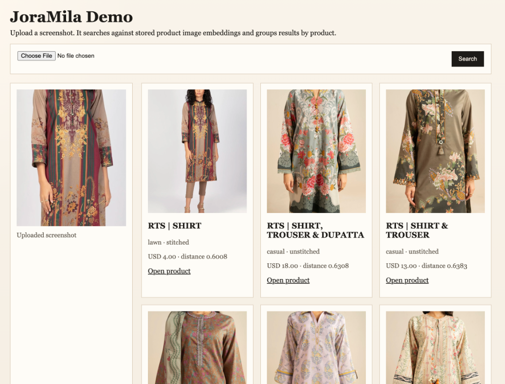

# JoraMila (جوڑا ملا)

> **Translation:** Jora Mila translates from Urdu to English as **"Match the Outfit"** or **"Pair Matching"**.

An end-to-end **e-commerce visual search pipeline** that scrapes retail storefronts, processes product imagery, and hosts a localized semantic UI for screenshot-to-product discovery.

Rather than just fetching data, JoraMila is designed as a decoupled architecture for turning raw retail catalog structures into searchable local vector databases.



---

## Architecture

The system is split into three modular phases:

1. **Ingestion (The Scraper):** A crawler configured to extract product URLs from sitemaps, bypass rate limits, handle pagination, and fetch metadata along with raw catalog images to `alkaram/images/`.
2. **Processing (The Embeddings):** An offline preprocessing pipeline that removes image backgrounds locally using the macOS native Vision framework, converts them to WebP, generates high-dimensional embeddings via **OpenCLIP**, and saves them to a `sqlite-vec` virtual table.
3. **Discovery (The UI)**: A lightweight, self-hosted FastAPI and Uvicorn interface where users can upload screenshots to retrieve and group nearest-neighbor products by embedding distance.

---

## Bring Your Own Data (BYOD)

Due to copyright restrictions, this repository does not include pre-packaged retail datasets or pre-populated SQLite databases. 

However, **the tools to extract and build the data are fully included.** The codebase is pre-configured with Alkaram sitemaps as the default demo target, allowing you to crawl, embed, and index a live catalog in minutes.

---

## Runbook

### 1. Installation
Install dependencies using `uv`:
```bash
uv sync
```

### 2. Ingestion
Run the pipeline to scrape products, download images, strip backgrounds, and generate embeddings. By default, this uses the Alkaram sitemaps target.
```bash
# Limit to 10 products for a quick dry-run
uv run python main.py --limit 10 --workers 4
```

### 3. Rebuilding Embeddings
If you update the preprocessing logic or switch OpenCLIP models, rebuild the database embeddings from locally cached images:
```bash
uv run python main.py --reembed-existing --workers 4
```

### 4. Running the Semantic Search UI
Launch the local web server to start searching:
```bash
uv run uvicorn alkaram.webui:app --reload --port 8069
```
Open [http://127.0.0.1:8069](http://127.0.0.1:8069) in your browser, upload an image/screenshot, and view similar products.
